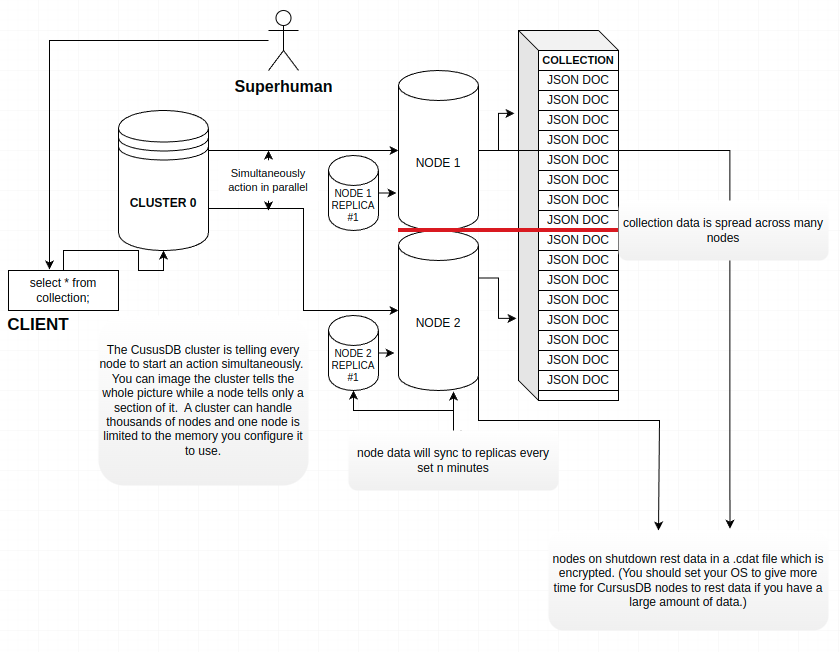
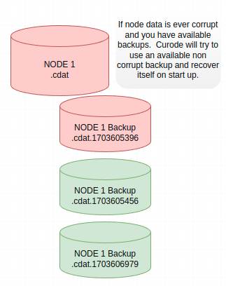
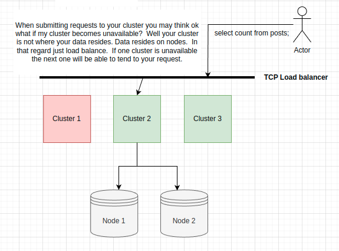
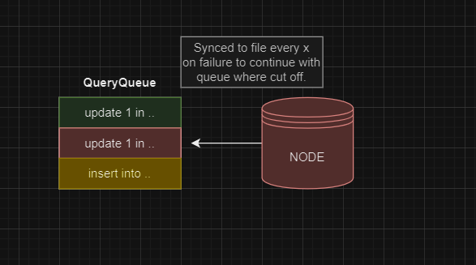
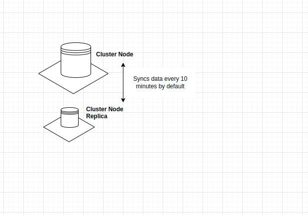
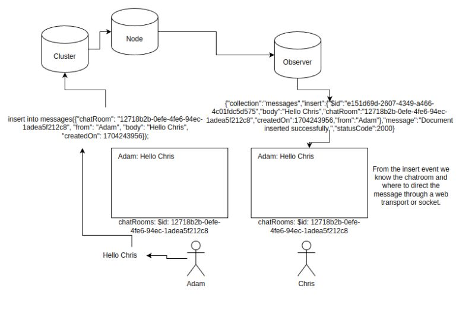

---- 


<div>
<h1 align="center"></h1>
</div>

## Cursus Database System
CursusDB is a fast open source in-memory document oriented database offering security, persistence, distribution, availability and an SQL like query language.

## Table of contents
<ul>

<li><a href="#features">Features</a></li>
<li><a href="#design-drawings">Design Drawings</a></li>
<li><a href="#docker">Docker</a></li>
<li><a href="#native-clients">Native Clients</a></li>
<li><a href="#native-observers">Native Observers</a></li>
<li><a href="#prebuild-binaries">Prebuilt Binaries</a></li>
<li><a href="#cluster-node-setup">Cluster & Node Building & Initial Setup</a></li>
<li><a href="#node-replicating">Node Replicating</a></li>
<li><a href="#query-language">Query Language</a>
<ul>
<li><a href="#ping-cluster">Ping the cluster</a></li>
<li><a href="#inserts">Inserts</a></li>
<li><a href="#selects">Selects</a></li>
<li><a href="#updates">Updates</a></li>
<li><a href="#deletes">Deletes</a></li>
<li><a href="#pattern-matching">Pattern Matching</a>
<ul>
<li><a href="#like">LIKE</a></li>
<li><a href="#not-like">NOT LIKE</a></li>
</ul>
</li>
<li><a href="#sorting">Sorting</a></li>
<li><a href="#counting">Counting</a></li>
<li><a href="#uniqueness">Uniqueness</a></li>
<li><a href="#delete-key">Deleting a key within documents in a collection</a></li>
<li><a href="#operators">Operators</a></li>
<li><a href="#conditional-symbols">Conditional Symbols</a></li>
<li><a href="#actions">Actions</a></li>
<li><a href="#list-collections">List collections</a></li>
<li><a href="#deleting-collections">Deleting collections</a></li>
<li><a href="#database-users">Database users</a>
<ul>
<li><a href="#listing-database-users">Listing database users</a></li>
<li><a href="#remove-database-users">Removing database users</a></li>
</ul>
</li>
</ul>
</li>
<li><a href="#logging">Logging</a>
<li><a href="#status-codes">Status Codes</a>
<ul>
<li><a href="#other">Other</a></li>
<li><a href="#authentication-authorization">Authentication / Authorization</a></li>
<li><a href="#node-cluster">Node / Cluster</a></li>
<li><a href="#document-cdql">Document & CDQL</a></li>
</ul>
</li>
<li><a href="#default-ports">Default Ports</a>
<li><a href="#reserved-doc-keys">Reserved Document Keys</a>
<li><a href="#mysql-v-cursusdb">MySQL v CursusDB Benchmark</a>
<li><a href="#cluster-to-node-tls-and-node-to-node-tls">Cluster to Node TLS connectivity & Node to Node replica TLS connectivity</a>
<li><a href="#what-is-a-node-observer">What is a Node Observer?</a>
<li><a href="#doc-expectation-relation">Document Expectation & Document Relation</a>
<li><a href="#live-chat-observer">Live Chat using an Observer</a>
<li><a href="#report-issues">Reporting Issues</a>
</ul>


📙📙 https://cursusdb.com/documentation


>  The idea behind CursusDB was to create something unlimitedly scalable whilst never really slowing down. Say you have 1 billion documents stored within 1 collection spread across 100 nodes the cluster will query 1 billion documents in the time it takes to query 10 million as the cluster initiates a non insert action on all nodes simultaneously. This is the power of parallel search. The Cursus system is searching say in the users collection in multiple sections of the collection simultaneously.  A cluster can query thousands of nodes at the same time.  Think of main nodes as shards of many or one collection.  Each collection locks on insert, update and delete but because of CursusDB's distributed design it's like a concurrent switch board that allows for large amounts of concurrent transactions.  A cluster or many clusters take actions, these actions are relayed as requests to 1 or many nodes simultaneously.  Consistency and reliability was one of the main goals when designing CursusDB.  If you have many cluster's setup through a TCP load balancer you can imagine transactions just don't miss if the system is configured correctly.  One more bit! Say you have multiple updates to one document the node will work in order of operation received.  The database system is well-designed, heavily tested and very stable;  It was designed and developed for my own need's with other projects/companies I have going on; Over the period of design and development it's very much turned into something special. With that I hope you all enjoy CursusDB! 

~ Alex Gaetano Padula

<h6 id="features" />

### Features
- Secured cluster and node(s) communication with shared key and OR TLS
- If configured secured node sync replication with TLS using ``tls-replication`` config within ``.curodeconfig``
- In-memory data during runtime
- Parallel search. Searching section of collections within multiple nodes simultaneously at the same time.
- Auto generated $id key for all documents unique across all nodes
- Database Users with basic (R, RW) permissions
- Cluster and node authentication
- Cluster node data replication and synchronization specifically for reads
- JSON object insert
- Unstructured collections
- Cluster and client authentication
- Node(s) (insert, update, delete) relay to observers in real time
- Node observer automatic reconnect if connection lost
- SQL like query language (CDQL - Cursus Document Query Language)
- Low-latency
- Highly available
- Unique k:v across all nodes using exclamation at end of key name ``email!``
- Secure by default with shared key and users
- Highly configurable
- Lightweight core code under 6000 lines of code in total
- File logging and automatic log truncation based on ``log-max-lines`` config
- Automatic reconnect of any lost node or node replica
- Automatic node backups if ``automatic-backup`` within ``.curodeconfig`` is set to true
- Automatic node backup clean up if ``automatic-backup-cleanup`` within ``.curodeconfig`` is set to true.
- Automatic node recovery if data is corrupt if ``automatic-backup`` configured
- Node data(`.cdat`) and node backups (`/backups/.cdat.{unixtime}`) are created by taking what's in memory serializing it, encrypting it and compressing it block by block via serialization-encryption(chacha20poly1305)-compression(DEFLATE)  on shutdown or backup

**There are no databases like MySQL let's say where you can have multiples.  A cluster is your database that spreads data across many nodes.**

<h6 id="design-drawings" />

---












A node keeps track of queries/txns and if something bad happens can re-trigger what hasn't been processed.  A node syncs to a .qqueue file every 2 milliseconds this is fixed and cannot be changed.
`.qqueue` files are encrypted.


<h6 id="docker" />

## Docker
https://hub.docker.com/repositories/cursusdb (SOON)

<h6 id="native-clients" />

## Native Clients
- SHELL https://github.com/cursusdb/curush ``STABLE ✔️``
- GO https://github.com/cursusdb/cursusdb-go ``STABLE ✔️``
- NODE.JS https://github.com/cursusdb/cursusdb-node OR https://www.npmjs.com/package/cursusdb-node ``STABLE ✔️``
- PYTHON https://github.com/cursusdb/cursusdb-py ``STABLE ✔️``
- JAVA https://github.com/cursusdb/cursusdb-java ``STABLE ✔️``
- CSHARP https://github.com/cursusdb/cursusdb-cs & Available on nuget! ``STABLE ✔️``

<h6 id="native-observers" />

## Native Observers
- NODE.JS https://github.com/cursusdb/cursusdb-observer-node OR https://www.npmjs.com/package/cursusdb-observer-node ``STABLE ✔️``
- GO https://github.com/cursusdb/cursusdb-observer-go ``IN PROGRESS 👨‍💻``

.. more coming

<h6 id="prebuild-binaries" />

## Prebuilt Binaries
You can find the latest stable release prebuilt binaries at
https://cursusdb.com/downloads

<h6 id="cluster-node-setup" />

## Cluster & Node Building & Initial Setup
Getting started with CursusDB is extremely easy!  First you  must build a cluster and node binary.  To do that clone the source and follow below:

You must make sure you have GO installed minimum version 1.21.3, once installed follow below.
``` 
git clone git@github.com:cursusdb/cursusdb.git
cd cluster
go build .
cd ..
cd node 
go build .
```

Now you should have a curode and a cursus binary.


Now with both we first start cursus to setup a database user, .cursusconfig and a shared key which will be used for your node as well.  This key is used to authenticate your cluster and nodes also encrypt your data at rest with ChaCha!


So now that we have our credentials setup we have to setup our first node!

We can run a node on the same instance as a cluster for this example.  After completion of cluster setup through the initial run you'll get a .cursusconfig which has a few configurations.
``` 
nodes: []
host: 0.0.0.0
tls-node: false
tls-cert: ""
tls-key: ""
tls: false
port: 7681
key: QyjlGfs+AMjvqJd/ovUUA1mBZ3yEq72y8xBQw94a96k=
users:
    - YWxleA==:7V8VGHNwVTVC7EktlWS8V3kS/xkLvRg/oODmOeIukDY=
node-reader-size: 2097152
log-max-lines: 1000
join-responses: false
logging: false
timezone: Local
log-query: false
node-read-deadline: 2
```
- **nodes** - database cluster nodes.  i.e an ip/fqdn + port combination (cluster1.example.com:7682)
- **tls-node** - whether the cluster will connect to nodes via tls
- **tls-cert** - path to your tls cert for cluster
- **tls-key** - path to your tls key for cluster
- **tls** - enable or disable tls 
- **port** - cluster port
- **key** - encoded shared key
- **users** - array of database users serialized, and encoded.
- **node-reader-size** - the max size of a response from a node
- **join-responses** - join all node responses and limit based on provided n
- **logging** - start logging to file
- **timezone** - Default is Local but format allowed is for example America/Toronto
- **log-query** - Logs client ip and their query to logs and std out if enabled
- **node-read-deadline** - Amount of time in seconds to wait for a node to respond

Let's put in under nodes a local node we will start shortly.
``` 
nodes:
- host: 0.0.0.0
  port: 7682
```

Now with your .cursusconfig setup let's start our node for the first time.


You'll see that I've added the same key as I did for the cluster and the node is now started! 

Let's start our cluster now.


Look at that!  We are all set to start inserting data.  Let's insert a user document into a users collection with a unique email key value using the curush(CursusDB Shell)


We can use curush with flag ``--host`` which will use the default port for a cluster 7681.  If we wanted to specify a different port we can used the ``--port ``flag.  If your cluster is using TLS make sure when using curush to also enable tls using flag ``--tls=true``.


curush will ask for a database user username and password to connect to cluster.  Once authorized you can start running queries!
``` 
insert into users({"name": "Alex", "lastName": "Padula", "age": 28, "email!": "apadula@cursusdb.com"});
```


On inserts every document will get a unique ``$id `` key which is unique across all nodes.


If we try and insert the same document we will get an error stating an existing document already exists.  This is because we set ``email`` with and ``!`` 


<h6 id="node-replicating" />

## Node Replicating
.cursusconfig
```
nodes:
- host: 0.0.0.0
  port: 7682
  replicas:
  - host: 0.0.0.0
    port: 7683
..
```

Node at ``0.0.0.0:7682`` has a configured replica at ``0.0.0.0:7682``

On the nodes end you need to configure a replica so the node you're configuring knows to replicate the data over.

.curodeconfig
``` 
replicas:
  - host: 0.0.0.0
    port: 7683
tls-cert: ""
tls-key: ""
..
```

Default sync time is 10 minutes and can be configured with yaml config ``replication-sync-time`` the node will sync its data to its configured replicas.
If original node shuts down or is not available a replica will be used for reads, if a replica is not available another available replica will be used(a node can configure multiple replicas).



<h6 id="query-language" />

## Query Language
Case-sensitive.. Keep it lowercase as the examples.

<h6 id="ping-cluster" />

### Ping the cluster
Using curush or native client

```
> ping;
> pong;
```

<h6 id="inserts" />

### Inserts
```
insert into users({"name": "Alex", "last": "Lee", "age": 28});
insert into users({"name": "John", "last": "Josh", "age": 28, "tags": ["tag1", "tag2"]});
```

<h6 id="selects" />

### Selects
```
select {LIMIT} from {COLLECTION} where {CONDITIONS} {ORDERING}
select * from users;
select 0,2 from users;
select 1 from users where name == 'Alex' || name == 'John';
select * from users where name == 'Alex' && age == 28;
select * from users where tags == "tag1";
select * from users where name == 'Alex' && age == 28 && tags == 'tag1';
```

##### NOTE
You can use ``==`` OR ``=``

For example 
``` 
select 1 from users where name == 'Alex' || name == 'John';
```

OR
``` 
select 1 from users where name = 'Alex' || name = 'John';
```

<h6 id="updates" />

### Updates
```
update {LIMIT} in {COLLECTION} where {CONDITIONS} {SETS} {ORDERING}
update 1 in users where age >= 28 set name = 'Josie' order by createdAt desc;
update * in users where age > 24 && name == 'Alex' set name = 'Josie' set age = 52;
update n, n..
ect..
```

<h6 id="deletes" />

### Deletes
```
delete {LIMIT} from {COLLECTION} where {CONDITIONS} {ORDERING}
delete * from users where age >= 28 || age < 32;
delete 0,5 from users where age > 28 && name == 'Alex';
ect
```

<h6 id="pattern-matching" />

### Pattern Matching

<h6 id="like" />

#### LIKE
Starts with 'A'
``` 
select * from users where firstName like 'A%lex Padula'
```

Ends with 'la'
``` 
select * from users where firstName like 'Alex Padu%la'
```

Contains Pad
``` 
select * from users where firstName like 'Alex %Pad%ula'
```

<h6 id="not-like" />

#### NOT LIKE
Starts with 'A'
``` 
select * from users where firstName not like 'A%lex Padula'
```

Ends with 'la'
``` 
select * from users where firstName not like 'Alex Padu%la'
```

Contains Pad
``` 
select * from users where firstName not like 'Alex %Pad%ula'
```

<h6 id="sorting" />

### Sorting
``` 
select * from users order by createdOn desc;
```

``` 
select * from users order by firstName asc;
```

<h6 id="counting" />

### Counting
Example
``` 
select count from users where $id == "099ade86-93a8-4703-abdd-d1ccc1078b1d";
```

Response not joined
``` 
[{"127.0.0.1:7682": [{"count":1}]}]
```

Response joined if each node has 1 match and there is 5 nodes
``` 
{"count":5} 
```

<h6 id="delete-key" />

### Deleting a key within documents in a collection 
It's very simple to alter a collections documents.  Say you want to remove the ``y`` key from a documents like below:
``` 
[{"$id":"fcb773f6-2d77-45fe-a860-9dd94f5e7c07","x":5,"y":7},{"$id":"a567925e-dbb1-405e-b4ac-12522b33d07e","x":2,"y":4},{"$id":"4fa938f6-6813-4db9-9955-f5e3c81a9c0b","x":55,"y":9}]}]
```

Simple using a native client:
``` 
curush>delete key y in example;
[{"127.0.0.1:7682": {"message":"Document key removed from collection successfully.","statusCode":4021,"altered":3}}]
```

<h6 id="uniqueness" />

### Uniqueness
using ``key!`` will make sure the value is unique across all nodes!
``` 
insert into users({"email!": "test@example.com" ...});
```

<h6 id="operators" />

### Operators
- ``>``
- ``>=``
- ``<``
- ``>=``
- ``==``
- ``=``
- ``!=``

<h6 id="conditional-symbols" />

### Conditional Symbols
- ``&&``
- ``||``

<h6 id="actions" />

### Actions
- ``select``
- ``update``
- ``delete``

<h6 id="list-collections" />

### List collections
```
curush>collections;
[{"127.0.0.1:7682": {"collections":["losers","winners","users"]}}]
```

<h6 id="deleting-collections" />

### Deleting collections?
When you remove every document from a collection the collection is removed i.e

``` 
delete * from losers;
```

``` 
..."1 Document(s) deleted successfully.","statusCode":2000}}]
```

```
curush>collections;
[{"127.0.0.1:7682": {"collections":["winners","users"]}}]
```

<h6 id="database-users" />

### Database Users
CursusDB has 2 permissions R(read) and (RW).  RW can select, insert, delete, update and add new users whereas users with just R can only read.

``` 
new user USERNAME, PASSWORD, P
```

Using a client like ``curush`` the CursusDB Shell Program.

``` 
curush> new user someusername, somepassword, RW;
```

<h6 id="listing-database-users" />

#### Listing Database Users

Getting all database users.  User with RW permission required.

```
users;
```

command returns JSON array of database users.
``` 
["alex","daniel"]
```

<h6 id="remove-database-users" />

#### Removing Database Users
``` 
delete user USERNAME;
```

<h6 id="status-codes" />

## Status codes
A CursusDB status code is a numerical value assigned to a specific message.  The numerical values are used as a shorthand to the actual message.  They are grouped by 
- ``Other`` signals, shutdowns
- ``Authentication / Authorization`` cluster and node auth
- ``Document & CDQL`` document and query language

<h6 id="other" />

#### Other
- ``-1`` Received signal (with signal) -1 is just for the system it doesn't mean error in CursusDB's case.

<h6 id="authentication-authorization" />

#### Authentication / Authorization
- ``0`` Authentication successful.
- ``1`` Unable to read authentication header.
- ``2`` Invalid authentication value.
- ``3`` No user exists
- ``4`` User not authorized
- ``5`` Failed node sync auth

<h6 id="node-cluster" />

#### Node / Cluster
- ``100`` - Node is at peak allocation
- ``101`` - Invalid permission
- ``102`` - User does not exist
- ``103`` - Database user already exists
- ``104`` - No node was available for insert
- ``105`` - Node unavailable
- ``106`` - Node ready for sync
- ``107`` - Node replica synced successfully
- ``108`` - Could not decode serialized sync data into hashmap
- ``109`` - No previous data to read.  Creating new .cdat file
- ``110`` - Could not open log file (with description)
- ``111`` - Data file corrupt (with description)
- ``112`` - Collection mutexes created
- ``113`` - Could not unmarshal system yaml configuration (with description)
- ``114`` - Could not marshal system yaml configuration (with description)
- ``115`` - Could not decode configured shared key (with description)
- ``116`` - Reconnected to lost connection (includes host:port)
- ``117`` - Reconnected to lost observer connection (includes host:port)
- ``118`` - Could not open/create configuration file (with description)
- ``119`` - Could not open/create data file (with description)
- ``120`` - No .qqueue file found.  Possibly first run, if so the node will create the .qqueue file after run of this method (after first run you will normally see ``505 0 recovered and processed from .qqueue.`` 0 being what was left on the query queue)
- ``200`` - New database user created successfully
- ``201`` - Database user removed successfully
- ``202`` - Could not decode user username
- ``203`` - Could not marshal users list array
- ``204`` - There must always be one database user available
- ``205`` - Could not marshal user for creation
- ``206`` - Could not get node working directory for automatic backup (with description)
- ``207`` - Could not create automatic backups directory (with description)
- ``208`` - Could not read node backups directory  (with description)
- ``209`` - Could not remove .cdat backup {FILE NAME} (with description)
- ``210`` - Could not get node working directory for automatic recovery (with description)
- ``211`` - Node recovery from backup was successful
- ``214`` - Node was unrecoverable after all attempts
- ``215`` - Attempting automatic recovery with latest backup
- ``216`` - Starting to sync to with master node
- ``217`` - Synced up with master node (with addr)
- ``218`` - Observer HOST:PORT was unavailable during relay
- ``219`` - Could not encode data for sync (with description)
- ``220`` - Starting to write node data to file
- ``221`` - Starting to write node data to backup file
- ``222`` - Node data written to file successfully
- ``223`` - Node data written to backup file successfully
- ``224`` - Observer connection established (with info)
- ``225`` - Node connection established (with info)
- ``500`` - Unknown error (with description)
- ``502`` - Node could not recover query queue
- ``503`` - Could not dial self to requeue queries (with description)
- ``504`` - Could not commit to queued query/transaction
- ``505`` - n recovered and processed from .qqueue
- ``507`` - Error loading X509 key pair (with description)

<h6 id="document-cdql" />

#### Document & CDQL
- ``2000`` Document inserted/updated/deleted
- ``4000`` Unmarsharable JSON insert
- ``4001`` Missing action
- ``4002`` None existent action
- ``4003`` Nested JSON objects not permitted
- ``4004`` Document already exists
- ``4005`` Invalid command/query
- ``4006`` From is required
- ``4007`` Invalid query operator
- ``4008`` Set is missing =
- ``4009`` Invalid insert query missing 'insert into'
- ``4010`` Invalid insert query is missing parentheses
- ``4011`` Invalid update query missing set
- ``4012`` Could not marshal JSON
- ``4013`` Unparsable boolean value
- ``4014`` Unparsable float value
- ``4015`` Unparsable integer value
- ``4016`` Missing limit value
- ``4017`` Invalid query
- ``4018`` Unmarsharable JSON
- ``4019`` Update sets are missing
- ``4020`` In is required
- ``4021`` Document key removed from collection successfully
- ``4022`` No documents found to alter
- ``4023`` No unique $id could be found for insert
- ``4024`` Batch insertion is not supported
- ``4025`` Where is missing values
- ``4026`` Delete key missing in
- ``4027`` Limit skip must be an integer (with description)
- ``4028`` Could not convert limit value to integer (with description)
- ``4029`` Invalid limiting value (with description)
- ``4030`` Key cannot use reserved word
- ``4031`` Key cannot use reserved symbol

<h6 id="reserved-doc-keys" />

## Reserved Document Keys
On insert there are a variety of RESERVED keys.
- `count`
- `$id`
- `$indx`
- `in`
- `not like`
- `!like`
- `where`
- `chan`
- `const`
- `continue`
- `defer`
- `else`
- `fallthrough`
- `func`
- `go`
- `goto`
- `if`
- `interface`
- `map`
- `select`
- `struct`
- `switch`
- `var`
- `false`
- `true`
- `uint8`
- `uint16`
- `uint32`
- `uint64`
- `int8`
- `int16`
- `int32`
- `int64`
- `float32`
- `float64`
- `complex64`
- `complex128`
- `byte`
- `rune`
- `uint`
- `int`
- `uintptr`
- `string`
- `==`
- `&&`
- `||`
- `>`
- `<`
- `=`
- `*`

<h6 id="default-ports" />

## Ports
Default cluster port: ``7681``
Default node port: ``7682``

<h6 id="logging" />

## Logging 
Logs for the CursusDB cluster and node are found where you launch your binaries.
Cluster: ``cursus.log``
Node: ``curode.log``

You can enable logging on either cluster or node enabling logging.  This will log to file instead of stdout
``` 
logging: true
```

Within your yaml configs you can set ``log-max-lines`` this option will tell either node or cluster when to truncate(clear up) the log file(s).

### How are logs are formatted?
[LEVEL][YOUR CONFIGURED TZ RFC822 DATE] DATA

Logs can have either level:
- <span style="color: red">ERROR</span>
- <span style="color: purple">FATAL</span>
- <span style="color: yellow">INFO</span>
- <span style="color: orange">WARN</span>

``` 
[INFO][26 Dec 23 08:34 EST] main(): 112 Collection mutexes created.
[INFO][26 Dec 23 08:34 EST] SignalListener(): -1 Received signal interrupt starting database shutdown.
[INFO][26 Dec 23 08:34 EST] WriteToFile(): 220 Starting to write node data to file.
[INFO][26 Dec 23 08:34 EST] WriteToFile(): 222 Node data written to file successfully.
```

### Example using curush querying cluster
``` 
./curush -host 0.0.0.0
Username> ******
Password> *****
curush>select * from users;

127.0.0.1:7682: [{"$id":"17cc0a83-f78e-4cb2-924f-3a194dedec90","age":28,"last":"Padula","name":"Alex"}]
curush>select * from users;

127.0.0.1:7682: [{"$id":"17cc0a83-f78e-4cb2-924f-3a194dedec90","age":28,"last":"Padula","name":"Alex"}]
curush>insert into users({"name": "Alex", "last": "Lee", "age": 28});

{"collection": "users", "insert":{"$id":"ecaaba0f-d130-42c9-81ad-ea6fc3461379","age":28,"last":"Lee","name":"Alex"},"message":"Document inserted","statusCode":2000}
curush>select * from users;

127.0.0.1:7682: [{"$id":"17cc0a83-f78e-4cb2-924f-3a194dedec90","age":28,"last":"Padula","name":"Alex"},{"$id":"ecaaba0f-d130-42c9-81ad-ea6fc3461379","age":28,"last":"Lee","name":"Alex"}]
```

^ Single node

If multiple nodes you'd see a response similar to the one below

```
curush>select * from users;

127.0.0.1:7682: [{"$id":"17cc0a83-f78e-4cb2-924f-3a194dedec90","age":28,"last":"Doe","name":"John"},..]
127.0.0.1:7683: [{"$id":"17cc0a83-f78e-4cb2-924f-3a194dedec91","age":32,"last":"Johnson","name":"Sarah"},..]
127.0.0.1:7684: [{"$id":"17cc0a83-f78e-4cb2-924f-3a194dedec92","age":42,"last":"Stint","name":"Peter"},..]

```

By default though you wont see above..
``` 
join-responses: false
```

is required to see results for each node.

``join-responses`` joins all documents from nodes and limits based on limit.  For example..

``` 
select 3 from posts order by createdOn desc;
```

The ``select 3`` portion the cluster will get depending on set amount of nodes say you have 5 nodes setup, you will get back 3 * 5 but the cluster will limit to 3 as that what was requested!


<h6 id="cluster-to-node-tls-and-node-to-node-tls" />

## Cluster to Node TLS connectivity & Node to Node replica TLS connectivity 
If you set ``tls-node`` on the cluster to true the cluster will expect all nodes to be listening on tls.

If you set ``tls-replication`` on a cluster node to true the cluster node will expect all node replicas to be listening on tls.

<h6 id="what-is-a-node-observer" />

## What is a Node Observer?
A node observer is a backend service using the CursusDB Observer package to listen to incoming node events such as insert, update, and delete in real time.

The observer must be configured with the same shared key as your nodes and clusters.

<h6 id="doc-expectation-relation" />

## Document Expectation & Document Relation
CursusDB expects simple JSON objects. For example take this user object:

```{"username!": "alex", "email!": "alex@test.com", "password": "xxx", "interests": ["programming", "music", "botany"]}```

This is an object CursusDB likes.

imagine you insert this object into a users collection:

```insert into users({"username!": "alex", "email!": "alex@test.com", "password": "xxx", "interests": ["programming", "music", "botany"]})```

```{"insert":{"$id":"17cc0a83-f78e-4cb2-924f-3a194dedec90", "username!": "alex", "email!": "alex@test.com", "password": "xxx", "interests": ["programming", "music", "botany"]},"message":"Document inserted","statusCode":2000}```
You can see username and email are set up to be unique using the suffixed ``!``. If CursusDB finds a user with that email or username you'll get back a 4004 error which means document already exists.

Now lets say this user can have many posts.
We will create a posts collection with the first post containing the users $id we created.

```insert into posts({"title": "First Post", "body": "This is a test post", "userId": "17cc0a83-f78e-4cb2-924f-3a194dedec90", "createdOn": 1703626015})```

As you can see we sorta just related data so now it's fairly easy to query the database and say hey give me all the users posts like so:

```select * from posts where userId = "17cc0a83-f78e-4cb2-924f-3a194dedec90";```

Remember how we had the createdOn as a unix timestamp on our posts documents? Awesome we can sort all the posts and paginate them!

Skipping 10 and grabbing 10

```select 10,10 from posts where userId = "17cc0a83-f78e-4cb2-924f-3a194dedec90" order by createdOn desc;```

Let`s say we want to sort the posts by title alphabetically:

```select * from posts where userId = "17cc0a83-f78e-4cb2-924f-3a194dedec90" order by title asc;```

This is how data should be related on CursusDB either a user has many posts or lets say a user has one account profile well same thing just repeat the process.

<h6 id="report-issues" />

## Report Issues 
Please report issues, enhancements, etc at:
- https://github.com/cursusdb/cursusdb/discussions
- https://github.com/cursusdb/cursusdb/issues

<h6 id="mysql-v-cursusdb" />

## CursusDB v MySQL BENCHMARK
Most basic setup.  CursusDB cluster and node hosted same instance no TLS.
MySQL setup exact same specification of an instance no TLS.

💨 <strong>Mind you Cursus(Cluster) was configured with one node.  If configured with multiple inserts GREATLY speed up more for concurrency but sequentially as well.</strong>

### CursusDB
```Connection time: 64ms```

Inserting 1002 records sequentially

```insert into users({"first": "James", "last": "Jones", "age": 22, "active": true});```

```Insertion time: 481.190374ms```

Read skipping 1000 selecting 1 where first is James

```select 1000,1 from users where first == "James";```


``Read time: 743.538µs``


### MySQL
``Connection time: 170ms``

Inserting 1002 records sequentially

```INSERT INTO users (first, last, age, active) VALUES ("James", "Jones", 22, true);```

```Insertion time: 1.928675495s```

Read skipping 1000 selecting 1 where first is James

```SELECT * FROM users where first = "James" LIMIT 1 OFFSET 1000;```


``Read time: 1.021852ms``

Table used

``CREATE TABLE users (
first varchar(255),
last varchar(255),
age int,
active BOOLEAN
);``

<h6 id="live-chat-observer" />

## Live Chat drawing using an Observer
How would a chat work with an Observer configured?
Let's say you have 2 collections, a chatrooms collections and a messages collection. On insert the node will relay to an observer if configured. On the backend where the observer lives you can have a socket server sending actions from an observer to many web socket or web transport clients. Take the example, we have 2 users in a chatroom with an $id of `12718b2b-0efe-4fe6-94ec-1adea5f212c8` which is unique. Adam sends a message to Chris which is an insert. At that point the cluster will insert into a node and the node will relay to an observer at which point we can relay that through to our connected clients to a specific room let's say. Very cool stuff!

